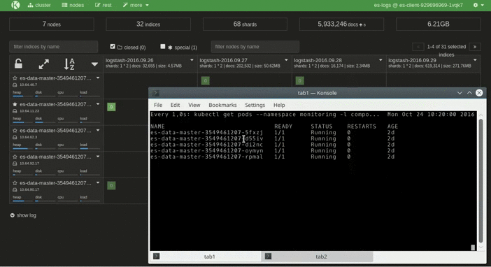
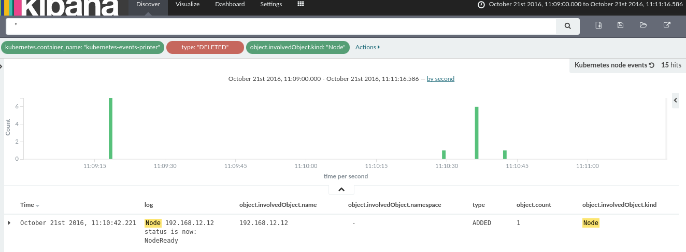

See also [Prometheus Kubernetes complete example](https://github.com/kayrus/prometheus-kubernetes)

# Info

This repo deploys complete ELK stack (actually **EFK**: **Elasticsearch, Fluentd, Kibana**. But ELK abbreviation is more popular) with the following components:

* Elasticsearch
  * es-data
  * es-master (3 replicas)
  * ~~es-data-master~~ (see [Upgrade from es-data-master deployment to splitted es-master and es-data](#upgrade-from-es-data-master-deployment-to-splitted-es-master-and-es-data))
  * es-client (client nodes which allow to communicate with the elasticsearch cluster, we use 2 pod replicas)
* fluentd - we use daemonsets, so fluentd is being scheduled on all worker nodes.
* kibana - one instance is enough. But you can easily scale it to two or more instances.

This repo already contains fluentd configuration example which works in most cases. It contains log modification examples, Java backtrace multiline logs processing, log parsing examples, [Kubernetes events processing](#forward-kubernetes-events-into-kibanaelasticsearch) and more.

Kibana deployment has built-in [Kaae](https://github.com/elasticfence/kaae) plugin which allows to generate notifications on logs anomalies. See [watcher example](kaae_watchers) (should be stored at https://kibana.example.com/app/kaae).

## Assumptions

### Namespace

This example uses `monitoring` namespace for Elasticsearch 2.x and `es5` for Elasticsearch 5.x. If you wish to use your own namespace, just export `NAMESPACE=mynamespace` environment variable.

### Insecure Elasticsearch connections

This repo should not be used in production when you use insecure public network. Fluentd is configured to send logs to Elasticsearch using insecure connection.

### Stateless storage

This repo contains Elasticsearch manifests which use stateless disk storage (`emptyDir`). It could be also useful for ephemeral storage in AWS. Fortunately using Elasticsearch [Replica Shards](https://www.elastic.co/guide/en/elasticsearch/guide/current/replica-shards.html) we have data redundancy. An amount of replica shards could be defined in [`es-env.yaml`](es-env.yaml) configmap (only in Elasticsearch 2.x, for Elasticsearch 5.x please follow [this](https://www.elastic.co/guide/en/elasticsearch/reference/5.0/indices-create-index.html) doc), default value is 1 which allows to survive one Elasticsearch data pod failure. When one Elasticsearch data pod is down (or removed), Kubernetes Deployment will schedule a new one.

One replica shard requires at least **three Elasticsearch data pods**. Rolling upgrade will relocate all the data from the pod prepared to be terminated. If you have only two data pods, there will be no place to move replica shards.

### Scheduling only one Elasticsearch data pod per node

Kubernetes supports Daemonsets but they don't provide rolling update feature. Thus this repo contains Deployment manifests with a hack - dummy 28651 `hostPort` which doesn't allow to schedule more than one pod on one node.

Kubernetes 1.4 introduced [Inter-pod affinity and anti-affinity](http://kubernetes.io/docs/user-guide/node-selection/#inter-pod-affinity-and-anti-affinity-alpha-feature) which also could be used to resolve this issue. [`es-data.yaml.tmpl`](es-data.yaml.tmpl) already contains `podAntiAffinity` annotation, thus in case when you use Kubernetes 1.4.x, please comment out the 28651 `hostPort` related code.

Unfortunately Deployment's rolling update feature has a flaw, it doesn't limit pods in "Terminating" state even when you use [`preStop`](http://kubernetes.io/docs/user-guide/pods/#termination-of-pods) hook. To workaround this issue, `./deploy.sh` script marks Kubernetes cluster nodes with the `elasticsearch.data=true` label. Which means that even when you have 10 nodes and 8 Elasticsearch pods, there will be not less than 7 `Running` pods and not more than one `Terminating` pod.

### Bash templates

Unless Kubernetes implement its own templating support, users have to use what they have (or use [Helm](https://github.com/kubernetes/helm) which should be installed). In most cases POSIX shell could be used and you don't have to install additional dependencies that is why `deploy.sh` uses `render_template` function as a hack that imposes appropriate restrictions: **if you wish to use double quotes inside the shell template you have to escape them**:

```sh
\"sample value inside double quotes\"
```

### Split Elasticsearch pods by roles

It is recommended to use splitted master and node roles, otherwise insufficient HEAP on high load could damage your Elasticsearch cluster (node which was elected by master could not track data nodes and cluster could have red status).

### Upgrade from es-data-master deployment to splitted es-master and es-data

If you already have **data-master** deployment from previous versions, you have to do the following:

* Delete old deployment and replicaset, but keep pods: `kubectl --namespace monitoring delete deployment es-data-master --cascade=false`, `kubectl --namespace monitoring delete rs es-data-master-INDEX --cascade=false`
* Change labels of the old pods from `role: data` to `role: data-master`
* Deploy `es-master.yaml`
* Wait for masters appear in ES cluster
* Deploy `es-data.yaml`
* Remove old `es-data-master-*` pods one by one and make sure indices were moved to new `es-data` pods

## Rolling update

[`run.sh`](docker/elasticsearch/run.sh) script inside Elasticsearch image contains shutdown handler which waits until the node move out all its data to another cluster nodes. And only when there is no data - pod shuts down. [`es-data.yaml.tmpl`](es-data.yaml.tmpl) template contains a `terminationGracePeriodSeconds: 31557600` option which prevents premature pod kill.



# Removing old indices

This repo already contains Curator deployment which by default removes indices older than 60 days (this option is configurable through `es-remove-indices-older-than-days` inside `es-env.yaml` file). Curator deployment uses `crond` which is already built in Apline Linux image and it runs `curator_cli` script every day at 2AM.

If you wish to update `es-remove-indices-older-than-days` variable, just edit `es-env.yaml` file and run `update_curator.sh` script.

# Ingress example

Example of an ingress controller to get an access from outside:

```yaml
apiVersion: extensions/v1beta1
kind: Ingress
metadata:
  annotations:
    ingress.kubernetes.io/auth-realm: Authentication Required
    ingress.kubernetes.io/auth-secret: internal-services-auth
    ingress.kubernetes.io/auth-type: basic
    kubernetes.io/ingress.allow-http: "false"
  name: ingress-monitoring
  namespace: monitoring
spec:
  tls:
  - hosts:
    - kibana.example.com
    - elasticsearch.example.com
    secretName: example-tls
  rules:
  - host: kibana.example.com
    http:
      paths:
      - backend:
          serviceName: kibana-logging
          servicePort: 5601
        path: /
  - host: elasticsearch.example.com
    http:
      paths:
      - backend:
          serviceName: elasticsearch-logging
          servicePort: 9200
        path: /
```

If you still don't have an Ingress controller installed, you can use manifests from the [`test_ingress`](https://github.com/kayrus/elk-kubernetes/tree/master/test_ingress) directory for test purposes.

# Installation

Simply run the command below:

```sh
./deploy.sh
```

In case when you use extra `kubectl` context (cluster) configuration, simply set `KUBECTL_PARAMS` environment variable:

```sh
KUBECTL_PARAMS="--context=foo" ./deploy.sh
# or
export KUBECTL_PARAMS="--context=foo"
./deploy.sh
```

Deploy and watch for the status:

```sh
./deploy.sh --watch
```

# Uninstallation

```sh
./undeploy.sh
```

In case when you use extra `kubectl` context (cluster) configuration, simply set `KUBECTL_PARAMS` environment variable:

```sh
KUBECTL_PARAMS="--context=foo" ./undeploy.sh
# or
export KUBECTL_PARAMS="--context=foo"
./undeploy.sh
```

# Live configuration

## Set labels to worker nodes

```sh
./apply_labels_on_nodes.sh
```

## Update Elasticsearch client deployment

The command below applies [`es-env.yaml`](es-env.yaml) config and [`es-client.yaml`](es-client.yaml) deployment:

```sh
./update_es_clients.sh --watch
```

## Update es-data deployment

The command below applies [`es-env.yaml`](es-env.yaml) config and [`es-data.yaml.tmpl`](es-data.yaml.tmpl) deployment:

```sh
./update_es_data.sh --watch
```

# Monitoring the cluster state

We use `kopf` plugin for elasticsearch. You can view the cluster state using links below:

* [https://elasticsearch.example.com/_plugin/kopf/](https://elasticsearch.example.com/_plugin/kopf/)
* [https://kibana.example.com/status](https://kibana.example.com/status)

# Kibana and GEO data

Fluentd container is already configured to import indices templates. If templates were not improted, you can import them manually:

```sh
wget https://github.com/logstash-plugins/logstash-output-elasticsearch/raw/master/lib/logstash/outputs/elasticsearch/elasticsearch-template-es2x.json
curl -XPUT 'https://elasticsearch.example.com/_template/logstash-*?pretty' -d@docker/fluentd/elasticsearch-template-es2x.json
```

Please note that if the index was already created (i.e. brand new deploy), you have to remove old index with incorrect data:

```sh
# This index has incorrect data
curl -s -XGET https://elasticsearch.example.com/logstash-2016.09.28/_mapping | python -mjson.tool | grep -A10 geoip
    "geoip": {
	"properties": {
	    "location": {
		"type": "double"
	    }
	}
    }
# Here how to delete incorrect index (ALL THIS INDEX DATA WILL BE REMOVED)
curl -XDELETE https://elasticsearch.example.com/logstash-2016.09.28
```

or wait until new index will be created (in our setup new index is being created every day).

# Forward Kubernetes events into Kibana/Elasticsearch

`k8s-events-printer.yaml` manifest is a simple `alpine` container with `curl` and `jq` tools installed. It prints all Kubernetes events into stdout and `fluentd` just parses and forwards these events into Elasticsearch as a regular json log.



# Known issues

* `journald` logs don't show up in Kibana, probably because of the TZ issues
* `DELETED` Kubernetes events could not be stripped for now, you have to create an exclude rule for `type:"DELETED"`, otherwise these events confuse Kibana users.
* Kubernetes < v1.3.6 has a [bug](https://github.com/kubernetes/kubernetes/issues/35333) which stops pause container before graceful Elasticsearch pod shutdown which results in inaccessible data pod while moving out shards.
* In some cases after rolling update each new pod gets the same IP addresse as an old one. This results in one empty node after rolling update is done. New [`docker/elasticsearch/pre-stop-hook.sh`](docker/elasticsearch/pre-stop-hook.sh) already contains a fix, but you have to manually clear the `cluster.routing.allocation.exclude._host` option: `curl -XPUT http://elk:9200/_cluster/settings -d'{ "transient" :{ "cluster.routing.allocation.exclude._host" : "" } }"'`.

# TODO

* Convert this repo into [Helm](https://github.com/kubernetes/helm) format.

# Credits

* This repo uses modified config files from https://github.com/pires/kubernetes-elasticsearch-cluster
* `pre-stop-hook.sh` from https://github.com/jetstack/elasticsearch-pet
* Initial Curator container: https://github.com/DocX/docker-curator-cron

# Pictures


