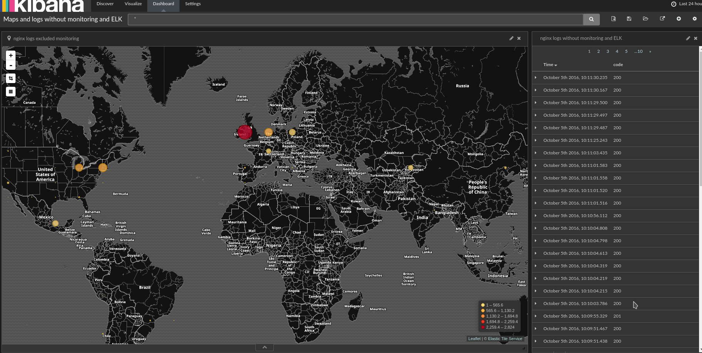

# Info

This repo deploys ELK stack with the following deployments/daemonsets:

* Elasticsearch
  * ~~es-data~~
  * ~~es-master~~
  * es-data-master (in our case we use emptydir which creates new directory every start and master node requires data storage. If we remove master storage - we will loose all indexes, so it is better to combine data and master nodes. And we can easily reboot one node and restore lost data from replicas. Default elasticsearch `NUMBER_OF_REPLICAS` is set to 1 inside [docker/elasticsearch/Dockerfile](docker/elasticsearch/Dockerfile) which means we can survive one node failure).
  * es-client (client nodes which allow to communicate with the elasticsearch cluster, we use 2 pod replicas)
* fluentd - we use daemonsets, so fluentd is being scheduled on all worker nodes.
* kibana - one instance is enough. But you can easily scale it to two or more instances.

Example of an ingress controller to get an access from outside:

```yaml
apiVersion: extensions/v1beta1
kind: Ingress
metadata:
  annotations:
    ingress.kubernetes.io/auth-realm: Authentication Required
    ingress.kubernetes.io/auth-secret: internal-services-auth
    ingress.kubernetes.io/auth-type: basic
    kubernetes.io/ingress.allow-http: "false"
  name: ingress-monitoring
  namespace: monitoring
spec:
  tls:
  - hosts:
    - kibana.example.com
    - elasticsearch.example.com
    secretName: example-tls
  rules:
  - host: kibana.example.com
    http:
      paths:
      - backend:
          serviceName: kibana-logging
          servicePort: 5601
        path: /
  - host: elasticsearch.example.com
    http:
      paths:
      - backend:
          serviceName: elasticsearch-logging
          servicePort: 9200
        path: /
```

# Monitoring the cluster state

We use `kopf` plugin for elasticsearch. You can view the cluster state using links below:

* [https://elasticsearch.example.com/_plugin/kopf/](https://elasticsearch.example.com/_plugin/kopf/)
* [https://kibana.example.com/status](https://kibana.example.com/status)

# Surviving the reboot

When you reboot the node, ES instance will become faily. Quick hook to make it happy - kill it. Kubernetes deployment will create a new pod, it will sync all replicas and ES cluster state will be green.

# Kibana and geo data

It is necessary to create the following index template to allow Kibana show fancy maps:

```sh
wget https://github.com/logstash-plugins/logstash-output-elasticsearch/raw/master/lib/logstash/outputs/elasticsearch/elasticsearch-template-es2x.json
curl -XPUT 'https://elasticsearch.example.com/_template/logstash-*?pretty' -d@elasticsearch-template-es2x.json
```

Please note that if the index was already created (i.e. brand new deploy), you have to remove old index with incorrect data:

```sh
# This index has incorrect data
curl -s -XGET https://elasticsearch.example.com/logstash-2016.09.28/_mapping | python -mjson.tool | grep -A10 geoip
    "geoip": {
	"properties": {
	    "location": {
		"type": "double"
	    }
	}
    }
# Here how to delete incorrect index (ALL THIS INDEX DATA WILL BE REMOVED)
curl -XDELETE https://elasticsearch.example.com/logstash-2016.09.28
```

or wait until new index will be created (in our setup new index is being created every day).

# Forward Kubernetes events into Kibana/Elasticsearch

`k8s-events-printer.yaml` manifest is a simple `alpine` container with `curl` and `jq` tools installed. It prints all Kubernetes events into stdout and `fluentd` just parses and forwards these events into Elasticsearch as a regular json log.

# TODO

## Automatically add indexes for geoip

* [https://github.com/uken/fluent-plugin-elasticsearch#template_name](https://github.com/uken/fluent-plugin-elasticsearch#template_name)

# Credits

This repo uses modified config files from https://github.com/pires/kubernetes-elasticsearch-cluster

# Pictures



